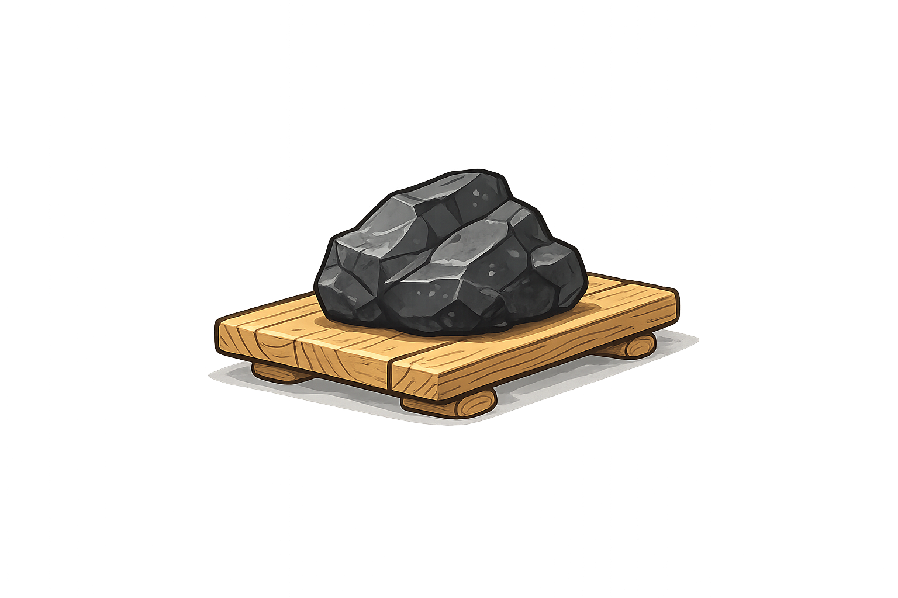
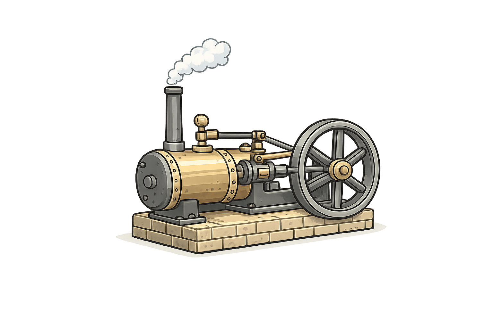
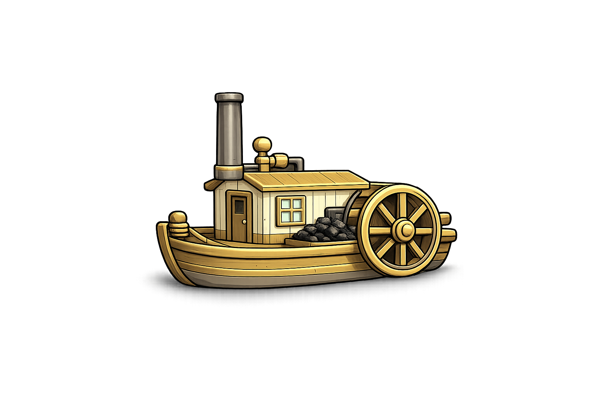
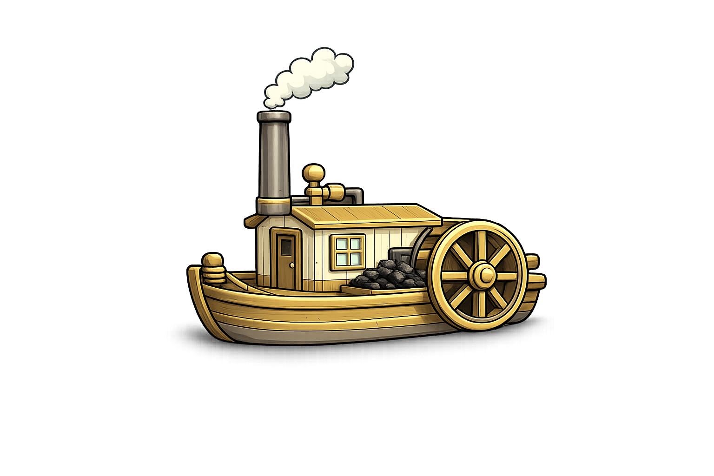

# Your first energy model {#sec-first-model}

We start with the smallest model that can exist — so small it does not work —
and grow it one object at a time until it burns coal and emits CO~2~. Every
step is a few lines of R, and every step you can solve and look at.

To keep the arithmetic in your head, the whole chapter uses:

- **one region**, `R1`
- **one year**, 2025
- **one time slice**, `ANNUAL` — no seasons, no hours

Time slices and multiple years arrive in a later session; here nothing competes
for attention with the energy balance itself.

::: {.callout-note appearance="simple"}
**Naming.** Throughout the workshop, an object's prefix says what kind of thing
it is: `repo_*` for repositories, `mod_*` for models, `scen_*` for solved
scenarios. Commodities and processes keep their bare set names (`ELC`,
`SUP_COA`, `ECOA`), because those strings are what the model itself uses.
:::

```{r}
source("R/workshop-model.R")
```

## Hello world: a demand and nothing else

An energy system model is, at heart, a **balance**: everything consumed must
come from somewhere. So let us declare only the consumption — electricity, and
a demand for 50 PJ of it a year — and see what happens.

```{r}
ELC <- newCommodity(
  name      = "ELC",
  desc      = "Electricity",
  unit      = "PJ",
  timeframe = "ANNUAL"
)

DEM_ELC <- newDemand(
  name      = "DEM_ELC",
  desc      = "Electricity demand",
  commodity = "ELC",
  unit      = "PJ",
  demand    = data.frame(demand = 50)      # 50 PJ a year
)

repo_EMPTY <- newRepository("repo_EMPTY", ELC, DEM_ELC)

mod_EMPTY <- newModel(
  name    = "HELLO",
  desc    = "A demand and nothing to serve it",
  data    = repo_EMPTY,
  region  = "R1",
  horizon = newHorizon(period = 2025, intervals = 1)
)
```

Now build the scenario. energyRt assembles it, but warns you first:

```{r}
scen_EMPTY <- interpolate_model(mod_EMPTY, name = "EMPTY")
```

```
Warning: There is no supply, production, interregional trade, or import for
demand-commodities in regions:
     comm region
   1  ELC     R1
The model will be infeasible unless these commodities are supplied.
```

It is a warning, not an error: the scenario is built, and you can send it to the
solver and see for yourself. There is no solution to read back, so tell
`solve_scenario()` not to look for one:

```{r}
solve_scenario(scen_EMPTY, read.solution = FALSE)
```

The solver's own verdict is the last line of its log:

```
GLPK Simplex Optimizer 5.0
7 rows, 5 columns, 10 non-zeros
Preprocessing...
PROBLEM HAS NO PRIMAL FEASIBLE SOLUTION
```

This is the first lesson, and it is worth more than it looks. The model is not
*wrong*, it is **infeasible**: no combination of decisions satisfies the
constraints, because one constraint says "deliver 50 PJ of ELC in R1" and
nothing in the model can produce a single joule. Note how small it is —
7 rows and 5 columns. Everything you write in energyRt ends up as a matrix like
this one, just larger.

::: {.callout-note}
Infeasibility is a normal result, not a crash. As models grow, most of the
problems you meet will be infeasibilities — a demand nothing can serve, a
capacity bound that is too tight, a policy constraint that contradicts another.
The skill is reading them.

energyRt warns rather than refusing to build, so you can always inspect an
incomplete model and hand it to the solver. If you would rather it stop at the
first such finding, set `options(en.model_checks_stop = TRUE)`.
:::

## Technically speaking, it is a model

{width="50%" fig-align="right"
  fig-alt="Hello world: a demand balanced by a single import."}

The cheapest fix is to buy the electricity from somewhere else. `newImport()`
brings a commodity in from outside the model — the rest of the world — at a
price:

```{r}
IMP_ELC <- newImport(
  name      = "IMP_ELC",
  desc      = "Electricity import from the rest of the world",
  commodity = "ELC",
  unit      = "PJ",
  import    = data.frame(price = 30)       # MEUR/PJ
)

draw(IMP_ELC)
```

Add it to the model and solve:

```{r}
repo_IMPORT <- newRepository("repo_IMPORT", ELC, DEM_ELC, IMP_ELC)

mod_IMPORT <- newModel(
  name    = "HELLO",
  desc    = "Demand served by imported electricity",
  data    = repo_IMPORT,
  region  = "R1",
  horizon = newHorizon(period = 2025, intervals = 1)
)

scen_IMPORT <- interpolate_model(mod_IMPORT, name = "IMPORT") |>
  solve_scenario()

getData(scen_IMPORT, "vObjective", merge = TRUE)   # total cost, MEUR
getData(scen_IMPORT, "vImportRow", merge = TRUE)   # imported ELC, PJ
```

That is a working energy system model. It imports 50 PJ and pays
50 × 30 = **1500 MEUR**. Trivial arithmetic — which is the point: you can check
the optimizer by hand, so you know the machinery is doing what you think.

Technically it is complete: a demand, a source, and a balance holding them
together. Everything else in this workshop is more of the same, with more
objects.

## Primary energy supply

{width="50%" fig-align="right"
  fig-alt="Coal as a new commodity and supply."}

Buying electricity is a poor deal. Let us produce it instead — from coal. That
takes two new objects. First the fuel itself: a commodity, and a **supply**
that makes it available at a price.

```{r}
COA <- newCommodity(
  name      = "COA",
  desc      = "Coal",
  unit      = "PJ",
  timeframe = "ANNUAL"
)

SUP_COA <- newSupply(
  name      = "SUP_COA",
  desc      = "Coal supply",
  commodity = "COA",
  unit      = "PJ",
  supply    = data.frame(cost = 2.5)       # MEUR/PJ
)

draw(SUP_COA)
```

{width="50%" fig-align="right"
  fig-alt="A steam engine: the technology that converts coal to electricity."}

## Technology
Second, something that turns coal into electricity. A **technology** is
energyRt's converter: it takes input commodities, produces output commodities,
and has a capacity that must be built and paid for.

```{r}
ECOA <- newTechnology(
  name    = "ECOA",
  desc    = "Coal-fired power plant",
  input   = list(comm = "COA", unit = "PJ", combustion = 1),
  output  = list(comm = "ELC", unit = "PJ"),
  units   = list(
    capacity = "GW",                       # capacity variables
    activity = "PJ",                       # activity (output) variables
    costs    = "MEUR"                      # currency of every cost parameter
  ),
  ceff    = data.frame(
    comm     = "COA",
    cinp2use = 0.40                        # 40% efficient
  ),
  invcost = list(invcost = 2000),          # MEUR/GW
  fixom   = 55,                            # MEUR/GW per year
  cap2act = 31.536,                        # PJ per GW per year
  olife   = 30L                            # operational life, years
)

draw(ECOA)
```

`draw()` sketches any process as a flow diagram — coal in on the left,
electricity out on the right. Use it whenever you are unsure what you actually
built.

## Complete model

{width="50%" fig-align="right"
  fig-alt="The assembled model: coal supply, plant and demand."}

Now put the whole thing together. Note that `IMP_ELC` stays in the model: the
import does not disappear, it simply has to compete.

```{r}
repo_COAL <- newRepository("repo_COAL",
                           ELC, COA, DEM_ELC, IMP_ELC, SUP_COA, ECOA)

mod_COAL <- newModel(
  name    = "HELLO",
  desc    = "Coal plant competing against imported electricity",
  data    = repo_COAL,
  region  = "R1",
  horizon = newHorizon(period = 2025, intervals = 1)
)

scen_COAL <- interpolate_model(mod_COAL, name = "COAL") |>
  solve_scenario(echo = FALSE)

getData(scen_COAL, "vObjective",  merge = TRUE)   # total cost, MEUR
getData(scen_COAL, "vTechCap",    merge = TRUE)   # capacity built, GW
getData(scen_COAL, "vTechInp",    merge = TRUE)   # coal burned, PJ
getData(scen_COAL, "vImportRow",  merge = TRUE)   # electricity imported, PJ
```

The model builds **1.585 GW** of coal capacity — exactly enough to make 50 PJ
at `cap2act = 31.536` — burns **125 PJ** of coal (50 ÷ 0.40), and imports
**nothing**. Total cost falls from 1500 to **505 MEUR**.

Nobody told the model to prefer coal. It compared building a plant and buying
fuel against paying 30 MEUR/PJ at the border, and the plant won. That
comparison *is* the model.

## Account emissions

{width="50%" fig-align="right"
  fig-alt="The same model, now emitting CO2."}

A coal plant that burns 125 PJ a year and emits nothing is not a model of
anything real. Emissions attach to the **fuel**: burning a joule of coal
releases CO~2~ regardless of which plant burns it, so the factor belongs on the
commodity, not on the technology.

```{r}
CO2 <- newCommodity(
  name      = "CO2",
  desc      = "Carbon dioxide",
  unit      = "kt",
  timeframe = "ANNUAL"
)

COA <- newCommodity(
  name      = "COA",
  desc      = "Coal",
  unit      = "PJ",
  timeframe = "ANNUAL",
  emis      = data.frame(
    comm = "CO2",
    unit = "kt/PJ",
    emis = 95                              # 95 kt of CO2 per PJ of coal
  )
)
```

The link that makes it work is `combustion = 1` on the technology's input,
which we already set on `ECOA`: it declares that the coal is *burned* rather
than merely consumed. Rebuild and solve:

```{r}
repo_EMIS <- newRepository("repo_EMIS",
                           ELC, COA, CO2, DEM_ELC, IMP_ELC, SUP_COA, ECOA)

mod_EMIS <- newModel(
  name    = "HELLO",
  desc    = "Coal plant with CO2 emissions",
  data    = repo_EMIS,
  region  = "R1",
  horizon = newHorizon(period = 2025, intervals = 1)
)

scen_EMIS <- interpolate_model(mod_EMIS, name = "EMIS") |>
  solve_scenario(echo = FALSE)

getData(scen_EMIS, "vTechEmsFuel", merge = TRUE)   # CO2 emitted, kt
getData(scen_EMIS, "vObjective",   merge = TRUE)   # total cost, MEUR
```

125 PJ × 95 kt/PJ = **11 875 kt** of CO~2~ a year.

Notice that the cost did not move: 505 MEUR, exactly as before. The model now
*measures* emissions but nothing makes them expensive or limits them, so they
change no decision. Attaching a price or a cap to CO~2~ — and watching the
answer change — is what the scenarios session is about.

## What you built

Five object types, and you have met all of them:

| Object | Role | Here |
|---|---|---|
| `newCommodity()` | something that flows | `ELC`, `COA`, `CO2` |
| `newDemand()` | consumption to be served | `DEM_ELC` |
| `newImport()` | a flow from outside the model | `IMP_ELC` |
| `newSupply()` | a domestic resource, at a price | `SUP_COA` |
| `newTechnology()` | converts commodities | `ECOA` |

and three verbs: `newModel()` to assemble, `interpolate_model()` to expand the
description over regions/years/slices, `solve_scenario()` to solve and read the
answer back.

## Exercises

**1.1 — Where is the tipping point?** The import costs 30 MEUR/PJ and coal
wins easily. Lower the import price until the model stops building the plant
and imports instead. Before running: do you expect the switch to be gradual or
sudden?

::: {.callout-tip collapse="true" title="Solution 1.1"}
```{r}
solve_at_price <- function(p) {
  imp <- newImport(
    name      = "IMP_ELC",
    commodity = "ELC",
    unit      = "PJ",
    import    = data.frame(price = p)
  )
  # CO2 must travel with COA now: the commodity carries an emission factor
  # that refers to it, and every referenced commodity must be in the model.
  repo_p <- newRepository("repo_p", ELC, COA, CO2, DEM_ELC, imp,
                          SUP_COA, ECOA)

  mod_p <- newModel(
    name    = "HELLO",
    data    = repo_p,
    region  = "R1",
    horizon = newHorizon(period = 2025, intervals = 1)
  )
  scen_p <- interpolate_model(mod_p, name = paste0("P", p)) |>
    solve_scenario(echo = FALSE)
  cap <- getData(scen_p, "vTechCap", merge = TRUE)$value
  data.frame(price = p, capacity = if (length(cap)) cap else 0)
}

do.call(rbind, lapply(c(30, 20, 15, 12, 10, 8), solve_at_price))
```
The switch is **sudden**. A linear program has no middle ground here: below the
break-even price importing is cheaper for every joule, so capacity drops
straight to zero rather than easing down.
:::

**1.2 — A cleaner, dearer plant.** Add a gas plant `EGAS` alongside `ECOA`:
58% efficient, `invcost` 900 MEUR/GW, `fixom` 25, `olife` 25, burning `GAS`
supplied at 6.0 MEUR/PJ with an emission factor of 56 kt/PJ. Which plant does
the model build, and what happens to CO~2~?

::: {.callout-tip collapse="true" title="Solution 1.2"}
```{r}
GAS <- newCommodity(
  name      = "GAS",
  desc      = "Natural gas",
  unit      = "PJ",
  timeframe = "ANNUAL",
  emis      = data.frame(comm = "CO2", unit = "kt/PJ", emis = 56)
)

SUP_GAS <- newSupply(
  name      = "SUP_GAS",
  desc      = "Natural gas supply",
  commodity = "GAS",
  unit      = "PJ",
  supply    = data.frame(cost = 6.0)
)

EGAS <- newTechnology(
  name    = "EGAS",
  desc    = "Gas-fired power plant",
  input   = list(comm = "GAS", unit = "PJ", combustion = 1),
  output  = list(comm = "ELC", unit = "PJ"),
  ceff    = data.frame(comm = "GAS", cinp2use = 0.58),
  invcost = list(invcost = 900),
  fixom   = 25,
  cap2act = 31.536,
  olife   = 25L
)

repo_GAS <- newRepository("repo_GAS",
                          ELC, COA, GAS, CO2, DEM_ELC, IMP_ELC,
                          SUP_COA, SUP_GAS, ECOA, EGAS)

mod_GAS <- newModel(
  name    = "HELLO",
  data    = repo_GAS,
  region  = "R1",
  horizon = newHorizon(period = 2025, intervals = 1)
)

scen_GAS <- interpolate_model(mod_GAS, name = "GAS") |>
  solve_scenario(echo = FALSE)

getData(scen_GAS, "vTechCap",     merge = TRUE)
getData(scen_GAS, "vTechEmsFuel", merge = TRUE)
getData(scen_GAS, "vObjective",   merge = TRUE)
```
**Nothing changes.** The model still builds 1.59 GW of `ECOA`, still emits
11 875 kt, and the objective stays at 505 MEUR — `EGAS` is never built.

Gas is cheaper to build (900 against 2000 MEUR/GW) and far more efficient (58%
against 40%), but fuel decides it. Per PJ of electricity, coal costs
2.5 ÷ 0.40 = **6.25 MEUR** and gas costs 6.0 ÷ 0.58 = **10.3 MEUR**. That gap
is wider than everything the cheaper plant saves, so the better technology
loses on the price of what it burns.

Two things worth taking from this. First, an optimization model will not build
something merely because it is *better* — only because it is cheaper under the
numbers you gave it. Second, CO~2~ follows the fuel choice and nothing else:
gas emits 56 kt/PJ against coal's 95, but nothing in this model prices carbon,
so that advantage buys it exactly nothing. Put a price on CO~2~ — as we will in
a later session — and the ranking can flip.

Try it now: lower the gas price until `EGAS` appears, the way you found the
import tipping point in 1.1.
:::
