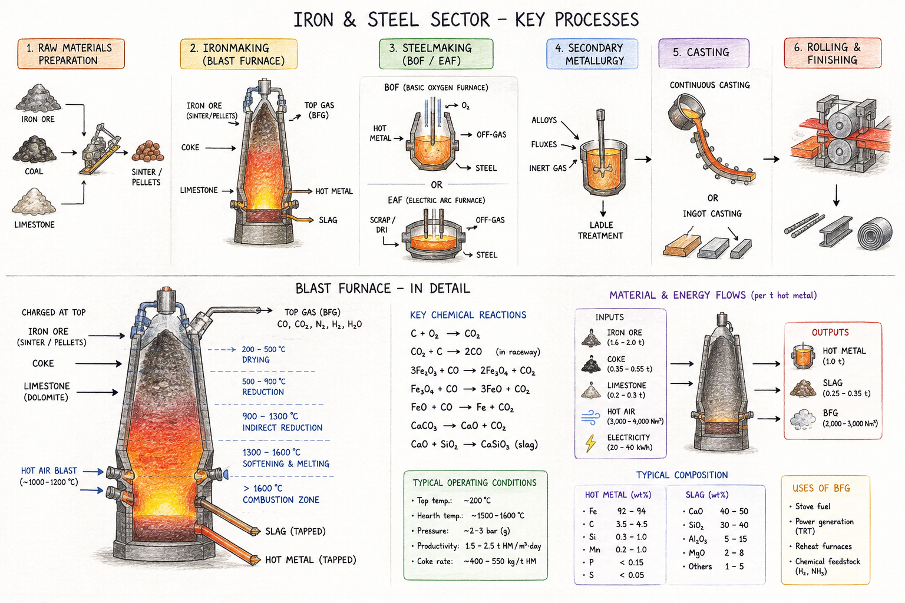
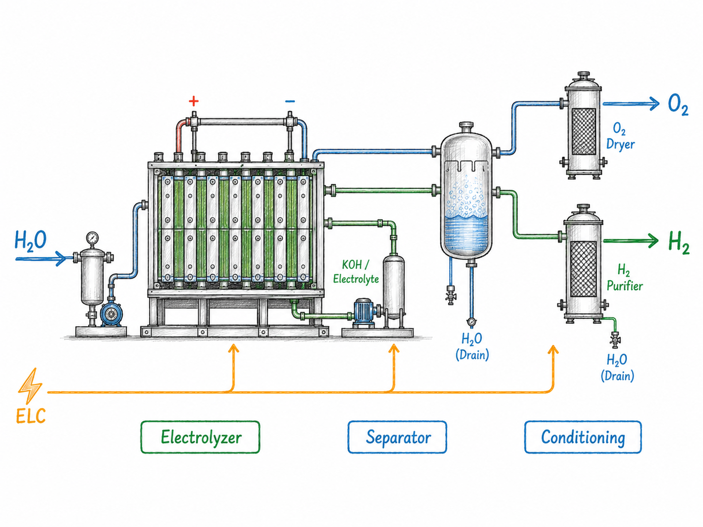
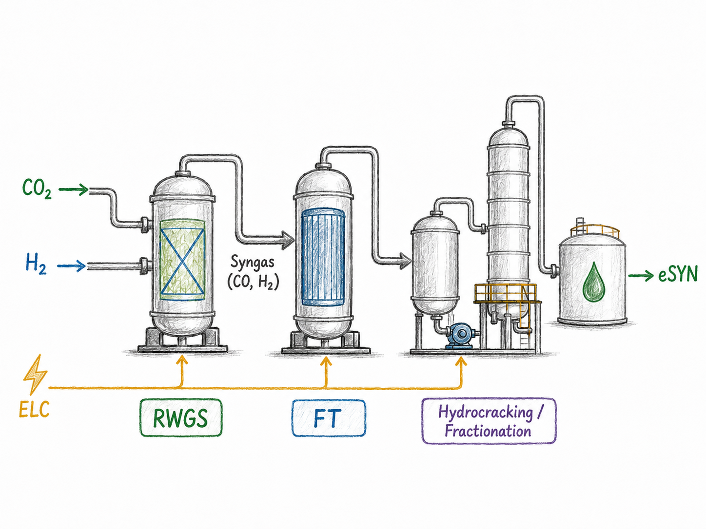

# Special cases of processes {#sec-processes}

So far every technology took one fuel and made one product. Real conversion
processes are messier: they consume several inputs, emit or co-produce several
outputs, and often serve a **service demand** (tonnes of steel, vehicle-kilometres)
rather than an energy commodity. Three recurring patterns cover most of it.

```{r}
source("R/workshop-model.R")
```

Two ideas do the heavy lifting throughout:

- **The conversion chain.** Inside a technology, `input → use → activity →
  output`, governed by three coefficient sets in `ceff`: `cinp2use` (fuel →
  common energy basis), `use2cact` (→ the central *activity* variable that all
  costs and capacity attach to), and `cact2cout` (activity → each output). All
  default to 1; unit conversions live here.
- **Auxiliary flows** (`aux` + `aeff`). Anything that rides *alongside* the main
  conversion — an emission produced, a by-product recovered, water consumed — is
  an aux flow, linked by a coefficient named `<driver>2a<out|inp>` (e.g.
  `act2ainp` = consumed per unit activity, `cout2aout` = produced per unit output).

::: {.callout-note appearance="simple"}
**Technology specifications.** The processes below are stored as YAML **techspec**
files under `tech_specs/`. Read one with `read_techspec()`, check it with
`tech_spec_issues()`, and build the `newTechnology()` object with `tech_from_spec()`
— the same round-trip the interactive **process-designer** GUI uses.
:::

A recurring trap: a **service demand** needs its own commodity *before* a
`newDemand()` can reference it, and its `unit`/`timeframe` must match. Model the
service (hydrogen, steel, vehicle-km) as a `newCommodity`, have the process produce
it, and pull it with a demand.

## Electrolyser — electricity → hydrogen {#sec-electrolyser}

The **flexible load** of @sec-siting, built properly: a PEM electrolyser that
consumes electricity, produces hydrogen, and recovers heat as a co-product. The
spec is `tech_specs/FPEM100.yml` (a DEA-catalogue 100 MW unit, in GWh), with
efficiency that **improves by vintage** (see @sec-vintages).

```{r}
#| eval: false
ELY <- tech_from_spec("tech_specs/FPEM100.yml")

draw(ELY) # electricity in; hydrogen and heat out
```

*Learning goal:* a single-input, multi-output conversion (H₂ + heat) with vintaged
efficiency; adding **water** as a consumed aux (`act2ainp`) is a one-line
extension. Reuse it as the time-flexible load whose siting follows the renewables.

*Exercises (to finish):* **4.1** `draw()` the electrolyser and read its vintaged
`cact2cout` for H₂; **4.2** screen its LCOE with `levcost()` at a few electricity
prices; **4.3** drop it into the @sec-siting model as the flexible load and confirm
it sites with the renewables.

## Blast furnace — iron & steel {#sec-blastfurnace}

A genuinely multi-input, multi-output process: iron ore, coke, and fluxes in; pig
iron out, with blast-furnace gas and slag as co-products and process CO~2~ from the
coke.

{fig-align="center"}

*Learning goal:* several inputs, some in an **input group** with shares
(ore + scrap), **combustion** on the reductant to book process CO~2~, and
**co-products as aux** (`cout2aout`); the chain closes on a `STEEL` service demand.

```{r}
#| eval: false

IRON <- newCommodity("IRON", unit = "Mt", timeframe = "ANNUAL")

BF <- newTechnology(
  name   = "BF",
  desc   = "Blast furnace",
  input  = list(
    comm       = c("IRON_ORE", "COKE", "SCRAP"),
    group      = c("i", NA, "i"),      # ore + scrap interchangeable
    unit       = c("Mt", "PJ", "Mt"),
    combustion = c(0, 1, 0)            # coke burns -> CO2
  ),
  output = list(comm = "IRON", unit = "Mt"),
  aux    = list(acomm = c("BF_GAS", "SLAG"), unit = c("PJ", "Mt")),
  aeff   = data.frame(
    comm     = c("IRON", "IRON"),
    acomm    = c("BF_GAS", "SLAG"),
    cout2aout = c(3.25, 0.20)          # co-product yields per unit iron
  ),
  ceff   = data.frame(
    comm      = c("IRON_ORE", "COKE", "SCRAP"),
    cinp2use  = c(NA, 9.30, NA),
    cinp2ginp = c(1.2, NA, 0.155)
  ),
  olife  = 20L
)

draw(BF) # ore + coke in; iron, blast-furnace gas and slag out
```

*Exercises (to finish):* **4.4** `draw()` the furnace and trace ore/coke in,
iron/gas/slag out; **4.5** add a scrap-fed electric-arc route (EAF, electricity as
aux via `cout2ainp`) and compare their CO~2~ per tonne — a preview of decarbonising
heavy industry.

## Light-duty vehicles — fuel → mobility {#sec-ldv}

A process whose output is a **service**: passenger-kilometres, not energy. Three
real specs ship in `tech_specs/` (converted to GWh): a battery-electric, a diesel,
and a gasoline-hybrid car fleet, each producing highway and city passenger-km
(`PLDVHWY` / `PLDVCTY`) from its fuel.

```{r}
#| eval: false
LDV_BEV <- tech_from_spec("tech_specs/LDV_BEV.yml")
LDV_DSL <- tech_from_spec("tech_specs/LDV_DSL.yml")
LDV_HYB <- tech_from_spec("tech_specs/LDV_HYB.yml")

draw(LDV_BEV) # electricity in; highway + city passenger-km out
```

*Learning goal:* a **service-demand** commodity in `MPKm`, the fuel-economy
conversion carried on `use2cact`/`cap2act` so energy, activity and capacity agree,
and a highway/city output **split by share**.

*Exercises (to finish):* **4.6** build the three fleets, `draw()` each, and check
the energy identity `vTechInp * cinp2use == vTechOut / (use2cact * cact2cout)`;
**4.7** give them a shared `PLDVHWY`/`PLDVCTY` demand and let the model choose the
fleet mix under a fuel price and, later, a carbon price.

## Build your own {#sec-build}

Three processes, three diagrams, no code — your turn to turn each picture into a
technology. Build it by hand (`newTechnology()`, or a YAML techspec like those in
`tech_specs/`) or, more easily, with the interactive **process designer**, which
lets you wire ports and blocks visually and exports a validated techspec:

```{r}
#| eval: false
process_designer() # launch the Shiny techspec editor
```

::: {.callout-note appearance="simple"}
The process designer's **online / AI-assisted** features (auto-drafting a spec
from a description or a diagram) need API keys that are **not set up for the course
yet** — we will cover those next session. The manual ports-and-blocks editor, and
everything in these exercises, works without them.
:::

**4.8 — An alkaline electrolyser.** Build the alkaline counterpart to the PEM
electrolyser of @sec-electrolyser from the diagram below: electricity in, hydrogen
out, with its own efficiency, capital cost and (optionally) a water input. Give it
vintages so its efficiency improves over time, then compare its `levcost()` with
`FPEM100`'s.

{width="55%" fig-align="center"}

**4.9 — Power-to-liquid e-synfuel (RWGS + Fischer–Tropsch).** A multi-step
power-to-liquid route: hydrogen and captured CO~2~ are combined — reverse
water-gas shift to syngas, then Fischer–Tropsch synthesis — into a synthetic
liquid fuel, with heat and tail gas as co-products. Build it as **one technology
with several inputs and several outputs**: `H2` and `CO2` in, the e-fuel out,
heat/tail-gas as aux (`cout2aout`). It is the natural downstream of the
electrolyser — the hydrogen it consumes is what @sec-electrolyser produces.

{width="60%" fig-align="center"}

**4.10 — A plug-in hybrid vehicle (PHEV).** A dual-fuel vehicle that draws
**both** electricity and gasoline. Starting from the `LDV_BEV` and `LDV_HYB` specs
in `tech_specs/`, build a PHEV that consumes the two fuels as an **input group**
with a share split, still producing `PLDVHWY`/`PLDVCTY` passenger-km, and add it to
the fleet-mix comparison of exercise 4.7.

{width="55%" fig-align="center"}

## Where this connects

- The **electrolyser** is the flexible load of @sec-siting — the same object, now
  with its real conversion and vintaged efficiency.
- **Groups + shares** (blast-furnace fuels, vehicle highway/city split) are the
  structural step beyond chapters 1–3 — and, since the grouped input/output
  balance now solves on GLPK, the blast furnace can be *run*, not just drawn,
  once its parameters are in.
- Everything here is pure LP and solves on **GLPK** once the specs are validated
  and wired to demands — none of it needs another backend.

*To be completed with worked, solvable solutions before the session — the
process-designer GUI builds and edits these specs interactively.*
